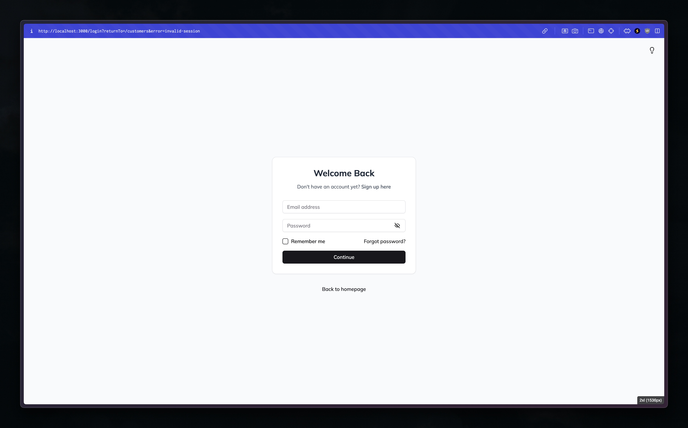

# Tailwind Debug Breakpoints

A Tailwind CSS plugin that display the currently active screen (responsive breakpoint).

<!--  -->

## Installation

#### Using NPM

```sh
npm install -D tailwind-debug-breakpoints
```

#### Using Yarn

```sh
yarn add --dev tailwind-debug-breakpoints
```

#### Using PNPM

```sh
pnpm add -D tailwind-debug-breakpoints
```

### Tailwind Configuration

```ts
import type { Config } from 'tailwindcss'

const TailwindConfig: Config = {
  content: [],
  theme: {
    extend: {},
    debugScreens: {
      position: ['bottom', 'right'],
      borderTopLeftRadius: '4px',
      printSize: true,
      prefix: '',
    },
  },
  plugins: [require('tailwind-debug-breakpoints')],
}

export default TailwindConfig
```

## License

This project is open-sourced software licensed under the [MIT License][choosealicense].

Copyrights in this project are retained by their contributors.

See the [license file](./LICENSE) for more information.

[choosealicense]: https://choosealicense.com/licenses/mit/

---

<sub>🤫 Psst! If you like my work you can support me via [GitHub sponsors](https://github.com/sponsors/riipandi).
